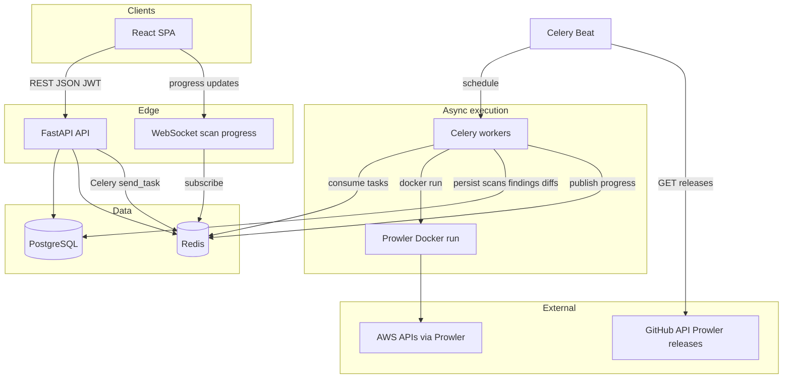

# Architecture

## Goals

- **Local-first**: single `docker-compose` stack for Postgres, Redis, API, worker, beat, and static web.
- **Microservice-friendly**: API and worker are separate processes/images; shared domain code lives under `services/api/app` and is copied into the worker image.
- **Async scans**: Prowler runs off the request path via **Celery** and **Redis**.
- **Real-time progress**: workers publish to **Redis pub/sub**; the API exposes a **WebSocket** that subscribes and forwards events to the browser.

## System diagram (Mermaid)

## Request flow (scan)

1. Client calls `POST /api/v1/clients/{id}/scans` with `credential_id`, optional `label`, optional `previous_scan_id`.
2. API validates credential ownership, creates a `scans` row (`pending`), enqueues `cloudaudit.execute_scan`.
3. Worker decrypts credentials (in memory only), runs Prowler in Docker with a **fixed argv** (no shell interpolation).
4. On success, worker runs `parse_findings` then `run_diff`, updates `scans.progress_pct`, and publishes Redis messages on channel `scan:{scan_id}:progress`.
5. UI opens `WebSocket /api/v1/ws/scans/{scan_id}?token=...` and displays `pct` / `stage`.

## Progress semantics

Prowler does not always expose fine-grained percentage completion. The implementation uses **stage-based** progress (e.g. queued → starting container → running Prowler → parsing → diff → completed) mapped to approximate percentages. The UI may also poll `GET /scans/{id}` for `status` and `progress_pct`.

## Future cloud deployment (not implemented here)

- Replace Docker-socket worker pattern with **Kubernetes Jobs**, **ECS tasks**, or a dedicated **runner** service.
- Move scan artifacts to **S3** and use **presigned URLs** for downloads.
- Replace dev Fernet key with **AWS KMS** or **Secrets Manager** using the same encryption abstraction in code.
